## Services

### Totem Food Payment Service

[](https://sonarcloud.io/summary/new_code?id=fiap-tech-challenge-4787bf24ba181ac258cb520837a657896a92044c_totem-food-payment-service)

[](https://sonarcloud.io/summary/new_code?id=fiap-tech-challenge-4787bf24ba181ac258cb520837a657896a92044c_totem-food-payment-service)
[](https://sonarcloud.io/summary/new_code?id=fiap-tech-challenge-4787bf24ba181ac258cb520837a657896a92044c_totem-food-payment-service)
[](https://sonarcloud.io/summary/new_code?id=fiap-tech-challenge-4787bf24ba181ac258cb520837a657896a92044c_totem-food-payment-service)
[](https://sonarcloud.io/summary/new_code?id=fiap-tech-challenge-4787bf24ba181ac258cb520837a657896a92044c_totem-food-payment-service)

### Totem Food Customer Service

[](https://sonarcloud.io/summary/new_code?id=fiap-tech-challenge-4787bf24ba181ac258cb520837a657896a92044c_totem-food-customer-service)

[](https://sonarcloud.io/summary/new_code?id=fiap-tech-challenge-4787bf24ba181ac258cb520837a657896a92044c_totem-food-customer-service)
[](https://sonarcloud.io/summary/new_code?id=fiap-tech-challenge-4787bf24ba181ac258cb520837a657896a92044c_totem-food-customer-service)
[](https://sonarcloud.io/summary/new_code?id=fiap-tech-challenge-4787bf24ba181ac258cb520837a657896a92044c_totem-food-customer-service)
[](https://sonarcloud.io/summary/new_code?id=fiap-tech-challenge-4787bf24ba181ac258cb520837a657896a92044c_totem-food-customer-service)


### Totem Food Order Service

[](https://sonarcloud.io/summary/new_code?id=fiap-tech-challenge-4787bf24ba181ac258cb520837a657896a92044c_totem-food-order-service)

[](https://sonarcloud.io/summary/new_code?id=fiap-tech-challenge-4787bf24ba181ac258cb520837a657896a92044c_totem-food-order-service)
[](https://sonarcloud.io/summary/new_code?id=fiap-tech-challenge-4787bf24ba181ac258cb520837a657896a92044c_totem-food-order-service)
[](https://sonarcloud.io/summary/new_code?id=fiap-tech-challenge-4787bf24ba181ac258cb520837a657896a92044c_totem-food-order-service)
[](https://sonarcloud.io/summary/new_code?id=fiap-tech-challenge-4787bf24ba181ac258cb520837a657896a92044c_totem-food-order-service)

### Totem Food Email Service

[](https://sonarcloud.io/summary/new_code?id=fiap-tech-challenge-4787bf24ba181ac258cb520837a657896a92044c_totem-food-email-service)

[](https://sonarcloud.io/summary/new_code?id=fiap-tech-challenge-4787bf24ba181ac258cb520837a657896a92044c_totem-food-email-service)
[](https://sonarcloud.io/summary/new_code?id=fiap-tech-challenge-4787bf24ba181ac258cb520837a657896a92044c_totem-food-email-service)
[](https://sonarcloud.io/summary/new_code?id=fiap-tech-challenge-4787bf24ba181ac258cb520837a657896a92044c_totem-food-email-service)
[](https://sonarcloud.io/summary/new_code?id=fiap-tech-challenge-4787bf24ba181ac258cb520837a657896a92044c_totem-food-email-service)

---

## Repositórios

- [totem-food-service-deploy-scripts](https://github.com/jeffersoncleyson/totem-food-service-deploy-scripts)
- [totem-food-order-service](https://github.com/jeffersoncleyson/totem-food-order-service)
- [totem-food-payment-service](https://github.com/jeffersoncleyson/totem-food-payment-service)
- [totem-food-customer-service](https://github.com/jeffersoncleyson/totem-food-customer-service)
- [totem-food-service-e2e](https://github.com/jeffersoncleyson/totem-food-service-e2e)
- [totem-food-service-tf-module-integration-api-gateway-and-eks](https://github.com/jeffersoncleyson/totem-food-service-tf-module-integration-api-gateway-and-eks)
- [totem-food-service-tf-module-api-gateway](https://github.com/jeffersoncleyson/totem-food-service-tf-module-api-gateway)
- [totem-food-service-tf-module-login](https://github.com/jeffersoncleyson/totem-food-service-tf-module-login)
- [totem-food-service-tf-module-eks](https://github.com/jeffersoncleyson/totem-food-service-tf-module-eks)
- [totem-food-service-tf-module-cognito](https://github.com/jeffersoncleyson/totem-food-service-tf-module-cognito)
- [totem-food-service-tf-module-authorizer](https://github.com/jeffersoncleyson/totem-food-service-tf-module-authorizer)
- [totem-food-service-helm-chart](https://github.com/jeffersoncleyson/totem-food-service-helm-chart)
- [totem-food-service-tf-module-components](https://github.com/jeffersoncleyson/totem-food-service-tf-module-components)
- [totem-food-service-tf-module-rds](https://github.com/jeffersoncleyson/totem-food-service-tf-module-rds)
- [totem-food-service-tf-module-sns-and-sqs](https://github.com/jeffersoncleyson/totem-food-service-tf-module-sns-and-sqs)

## Indice

Instrução para uso da aplicação se encontra no tópico [Executando a Aplicação](#executando-a-aplicação), os demais tópicos abaixo são documentações complementares.

- [Services](#services)
  - [Totem Food Payment Service](#totem-food-payment-service)
  - [Totem Food Customer Service](#totem-food-customer-service)
  - [Totem Food Order Service](#totem-food-order-service)
  - [Totem Food Email Service](#totem-food-email-service)
- [Repositórios](#repositórios)
- [Indice](#indice)
- [OWASP Reports](#owasp-reports)
- [Postman da Aplicação](#postman-da-aplicação)
- [Swagger da Aplicação](#swagger-da-aplicação)
  - [Swagger Totem](#swagger-totem)
- [Visão Geral da Aplicação](#visão-geral-da-aplicação)
- [Máquinas de Estado](#máquinas-de-estado)
- [Jornada dos Atores](#jornada-dos-atores)
- [Ambiente para desenvolvimento Docker Compose](#ambiente-para-desenvolvimento-docker-compose)
- [Docker Compose](#docker-compose)
- [Minikube](#minikube)
- [Terraform](#terraform)
- [Projeto](#projeto)
- [Processo de execução das Tasks](#processo-de-execução-das-tasks)
  - [PR (Pull Request)](#pr-pull-request)
  - [Commits](#commits)
- [Gerar docker build](#gerar-docker-build)
- [Pipeline](#pipeline)
    - [Organization: https://sonarcloud.io/organizations/fiap-tech-challenge-4787bf24ba181ac258cb520837a657896a92044c/members](#organization-httpssonarcloudioorganizationsfiap-tech-challenge-4787bf24ba181ac258cb520837a657896a92044cmembers)

---

## OWASP Reports

- [Varredura CSV](./documentation/reports/Totem_Food_Service_Varredura.csv)
- [Report antes da correção](./documentation/reports/Report_Before_Totem_Food_Service.pdf)
- [Report após correção](./documentation/reports/Report_After_Totem_Food_Service.pdf)
- [OWASP Session Backup](./documentation/reports/OWASP_ZAP_SESSION_Totem_Food_Service.zip)

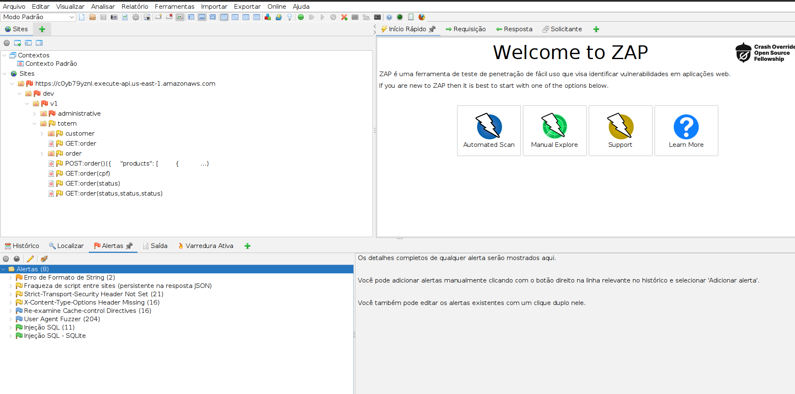


---

## Postman da Aplicação

Importar o arquivo abaixo no Postman:

- [collection_postman](./documentation/postman-collections/Entrega%20Fases.postman_collection.json)
- [remote_environment_postman](./documentation/postman-collections/SOAT-R.postman_environment.json)
- [local_environment_postman](./documentation/postman-collections/SOAT-L.postman_environment.json)

## Swagger da Aplicação

Para visualizar o swagger copiar o conteúdo do arquivo
- [Swagger Totem](./documentation/swaggers/totem-food-service.yaml)

após copiar cole no site do [swagger editor](https://editor.swagger.io/).

### Swagger Totem

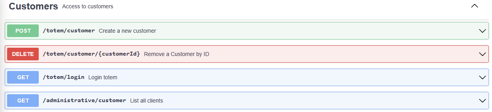
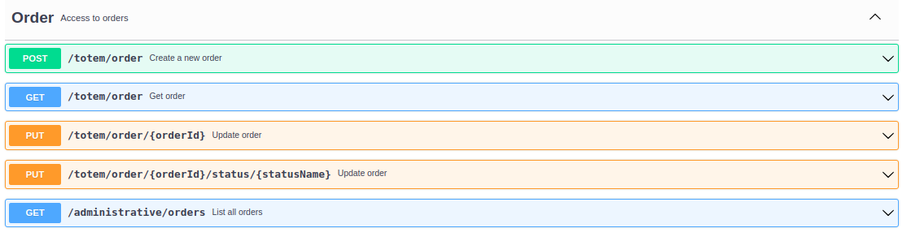
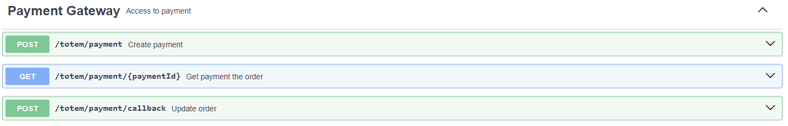
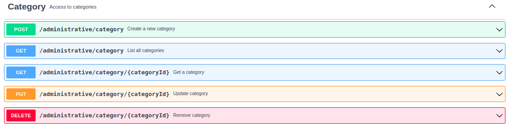
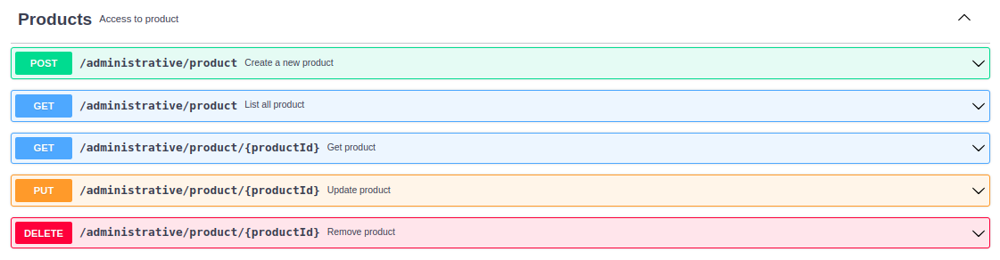

---

## Visão Geral da Aplicação

Visão global da aplicação em funcionamento

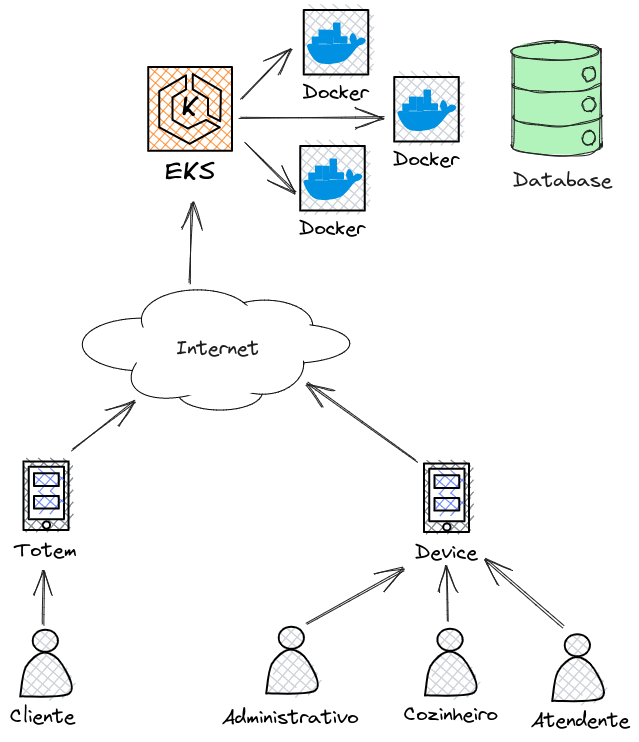

---

## Máquinas de Estado

- Order

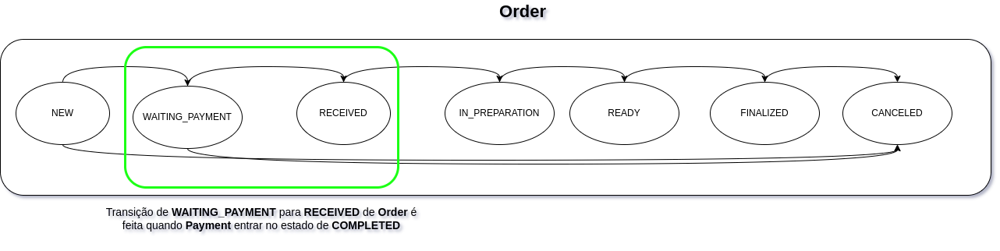

- Payment

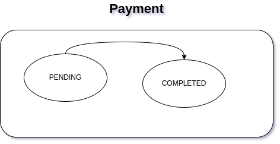

---

## Jornada dos Atores

* Administrador

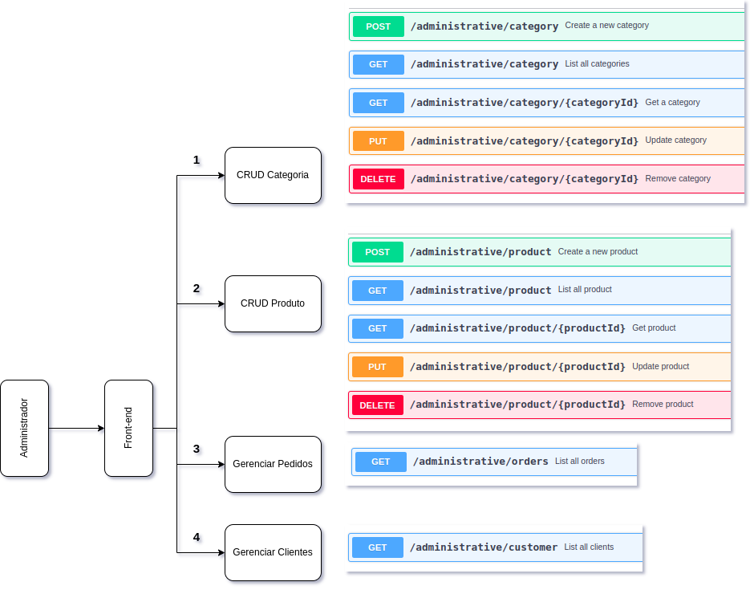

* Cliente

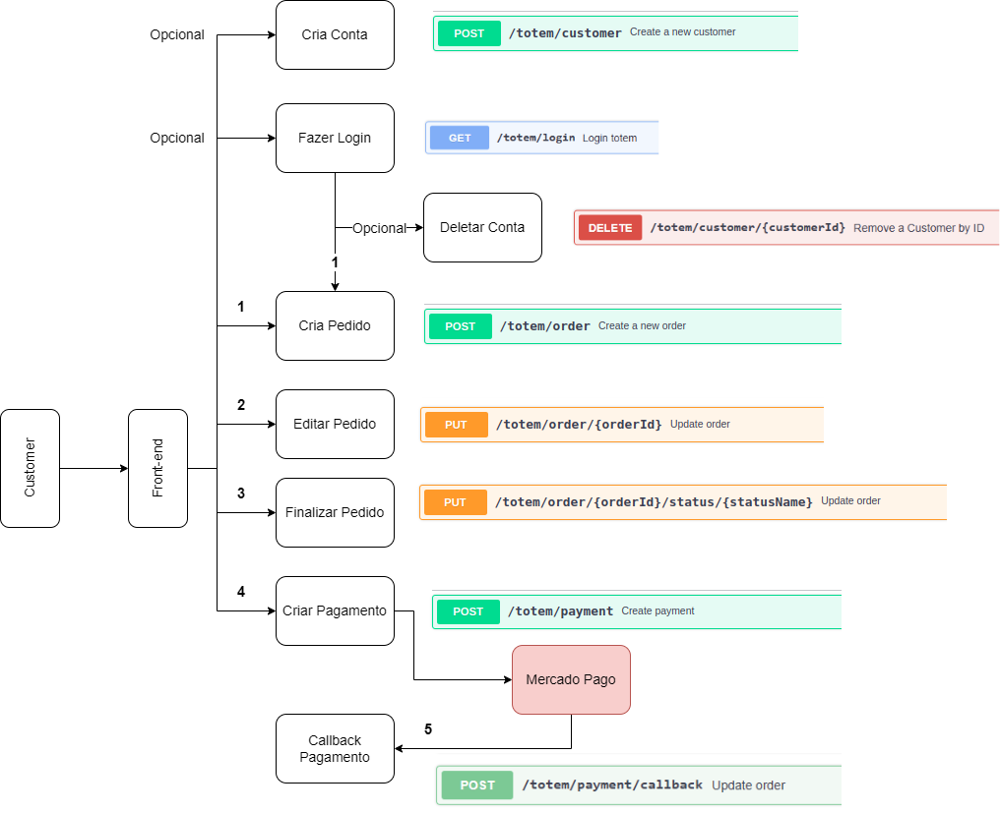

* Cozinha x Atendente

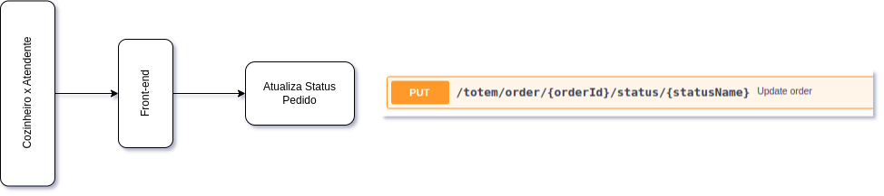

* Monitor

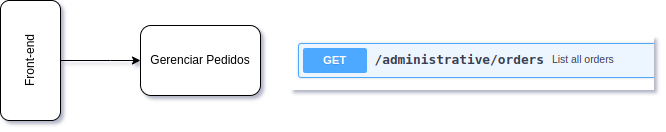

---

## Ambiente para desenvolvimento Docker Compose

[Executando a aplicação para desenvolvimento via docker-compose](./documentation/readme-doc/exec_app_docker_compose_dev.md)

## Docker Compose

[Executando a aplicação via docker-compose](./documentation/readme-doc/exec_app_docker_compose.md)

## Minikube

[Executando a aplicação via minikube](./documentation/readme-doc/exec_app_minikube.md)

## Terraform

[Executando a aplicação via terraform](https://github.com/jeffersoncleyson/totem-food-service-deploy-scripts/blob/main/initialize.sh)

---

## Projeto

Para execução do projeto esta sendo utilzado as seguintes bibliotecas e ferramentas abaixo.

* Java Versão 17
```
openjdk 17.0.7 2023-04-18
OpenJDK Runtime Environment (build 17.0.7+7-Ubuntu-0ubuntu120.04)
OpenJDK 64-Bit Server VM (build 17.0.7+7-Ubuntu-0ubuntu120.04, mixed mode, sharing)
```
* Maven versão 3.8.1
```
Apache Maven 3.8.1 (05c21c65bdfed0f71a2f2ada8b84da59348c4c5d)
Maven home: /usr/local/apache-maven-3.8.1
Java version: 17.0.7, vendor: Private Build, runtime: /usr/lib/jvm/java-17-openjdk-amd64
Default locale: pt_BR, platform encoding: UTF-8
OS name: "linux", version: "5.14.0-1059-oem", arch: "amd64", family: "unix"
```
* Docker version 23.0.1
```
Docker version 23.0.1, build a5ee5b1
```
* Docker Compose version 1.29.2
```
docker-compose version 1.29.2, build 5becea4c
```
* IntelliJ IDE Community Edition
```
IntelliJ IDEA 2023.1.2 (Community Edition)
Build #IC-231.9011.34, built on May 16, 2023
```
* MongoDB Compass versão 1.31.2

---

## Processo de execução das Tasks

Todo o processo de criação de novas features e correções de bugs devem sguir o processo desenhado abaixo

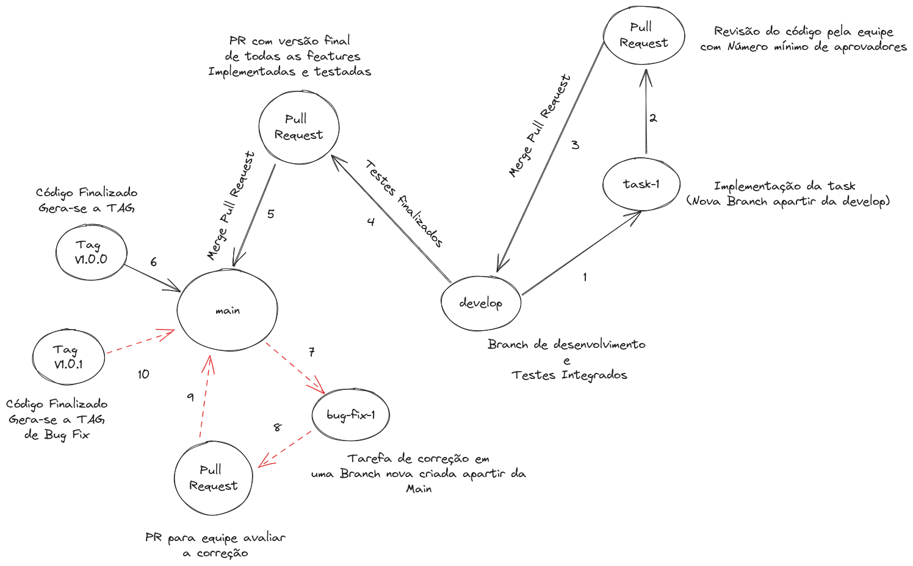


### PR (Pull Request)
Todos os PRs (Pull Requests) devem ter o corpo da mensagem abaixo:

Modelo: Features
```
Features:
  * Task X: Implementação da criação do item H
  * Task Y: Inclusão de novo endpoint na API W para cadastrar Z
```
Modelo: Bug Fix
```
Bug Fix
  * Task U.1: Correção do cadastro do item ABC
```

### Commits

Todos os commits devem contem uma das seguintes tags abaixo:

* *feat*: implementação de uma funcionalidade nova
* *fix*: correção de bugs
* *chore*: ajustes simples no código sem comprometer uma feature
* *style*: ajustes de identação, nome de variável ou remoção de imports não utilizados
* *docs*: alteração ou inclusão de documentação
* *ci*: alteração de pipelines
* *refactor*: refatoração de métodos e classes para uma melhor leitura do código ou desempenho
* *test*: inclusão de testes unitários ou de integração

Mensagem de todo commit:

Modelo
```
TAG_COMMIT: mensagem descrevendo o que foi feito no commit
```
Exemplo
```
feat: Foi criado novo endpoint na implementação de Y
```

---

## Gerar docker build

- Vá até o diretório da aplicação, onde se encontra o pom.xml

- Execute o comando maven para gerar o pacote

  ```bash
  mvn clean package
  ```

- Buildar o dockerfile, informando o Nome da imagem e a TAG, ao final o "." define que é para usar o dockerfile contino no diretório corrente

  ```bash
  docker build -t totem-food-service:1.0.0 .
  ```

- Para visualizar a imagem criada, basta listar com o comando ` docker images` 

- Para executar um container baseado na imagem gerada, basta executar o comando abaixo

  ```bash
  docker run -d -p 8080:8080 --name totem-food-service -t totem-food-service:1.0.0
  ```

- Para ver os logs, execute

  ```bash
  docker logs totem-food-service --follow
  ```

- Para matar a execução do container, execute

  ```bash
  docker rm -f totem-food-service
  ```

---

## Pipeline 

- Para análise de código e vulnerabilidade, utilizamos a ferramenta Sonar Cloud (https://sonarcloud.io/)

 #### Organization: https://sonarcloud.io/organizations/fiap-tech-challenge-4787bf24ba181ac258cb520837a657896a92044c/members
 
  